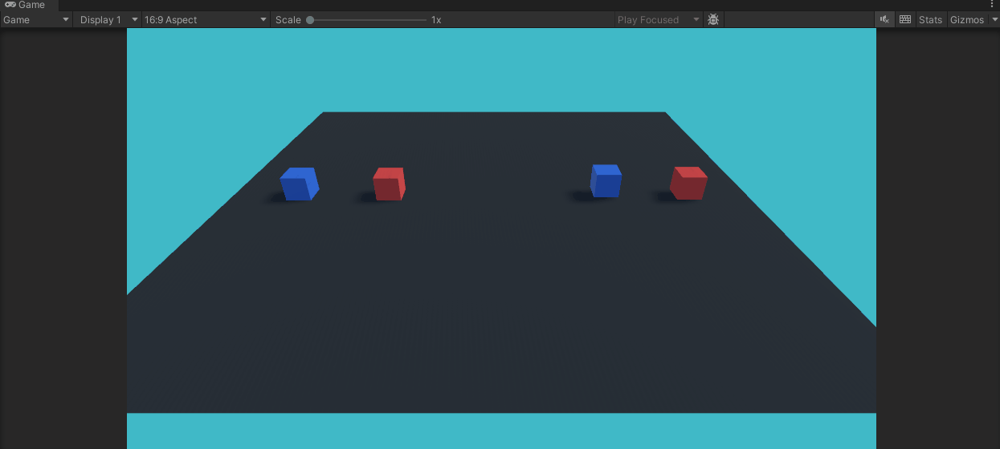

# Scripting

An introduction to the main concepts associated with Scripting are covered in [this](https://youtube.com/playlist?list=PLk0p6RIhmcflK_474ACvIo4MsL6yl-09b) YouTube.

In this page you can find an overview of the [project contents](docs/scripting#Project Material) seen in the video and an [exercise](scripting.md#Exercise) to practice the acquired knowledge.
## Project Material

All the videos refer to scenes and scripts contained in the "Assets/_Scripting" folder.  

- [00-Callbacks-Debug](scripting.md#00-Callbacks-Debug)
- [01-TargetFollower](scripting.md#01-TargetFollower)
- [02-DeltaTime](scripting.md#02-DeltaTime)
- [03-Keyboard-GetKey](scripting.md#03-Keyboard-GetKey)
- [04-KeyBoard-Input-Movement](scripting.md#04-KeyBoard-Input-Movement)
- [05-Camera-Independent-Movement](scripting.md#05-Camera-Independent-Movement)
### 00-Callbacks-Debug

This scene simply contains a red cube with a script attached to it that prints to the editor console, using the Debug.Log(), the different [Unity callbacks](https://docs.unity3d.com/Manual/ExecutionOrder.html).  

An even more detailed description on the execution order of Unity callbacks can be found in [this Unity thread](https://forum.unity.com/threads/a-comprehensive-guide-to-the-execution-order-of-unity-event-functions.1381647/)
### 01-TargetFollower


This scene shows a following behaviour scripted in the file, *TargetFollowe.cs*. The MonoBehaviour collects the referenced object from the Target property in the script and then follows rotating and moving with according to the other properties of the script.


### 02-DeltaTime

This scene simply sows the importance of using the property [Time.deltaTime](https://docs.unity3d.com/ScriptReference/Time-deltaTime.html)when moving objects during runtime. The proper usage of this property ensures to have an application which is not frame-dependant (i.e., the objects' behaviour is not affected by the framerate the application is capable to run on a given hardware). 

A further explanation of this concept, and other examples are detailed also in [this](https://docs.unity3d.com/Manual/TimeFrameManagement.html) Unity manual page.

### 03-Keyboard-GetKey


This scene shows how to use the [Input](https://docs.unity3d.com/ScriptReference/Input.html) class and specifically the [GetKey()](https://docs.unity3d.com/ScriptReference/Input.GetKey.html) function to detect input from the keyboard and act accordingly. In this action the example is very simple: the color of each cube is randomly assigned, using the [Random](https://docs.unity3d.com/ScriptReference/Random.html) class:

````csharp
private Color[] _colors = new[] {Color.red, Color.blue, Color.green, Color.magenta, Color.white, Color.cyan, Color.yellow, Color.black};

private void ChangeColor()  
{  
    if(_renderer == null)  
        return;  
    _renderer.material.color = _colors[Random.Range(0, _colors.Length)];  
}

``````

### 04-KeyBoard-Input-Movement



This scene demonstrates how to read directional input from either WASD or arrow keys. The cubes on the left have their movement continuously updated in order to maintain changes. The cubes on the right are translated from their original starting position based on the input read either through Input.GetKey() or Input.GetAxis(). This is to show how the input read through the first method is simply a boolean which can be either true or false. On the contrary, using the GetAxis() method the read input gradually increases and decreases from one of the extremes -1 or 1 to the rest value of 0.    

Further details on the GetAxis() function can be found in the [documentation page](https://docs.unity3d.com/ScriptReference/Input.GetAxis.html) or in [this](https://www.youtube.com/watch?v=MK4OmsViqMA) YouTube video.  

### 05-Camera-Independent-Movement

TBD
## Exercise

